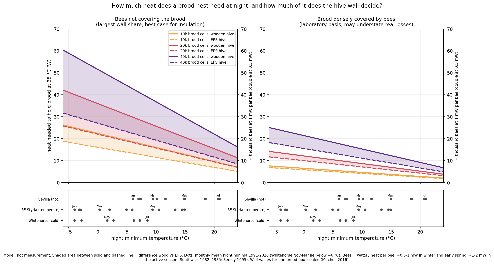
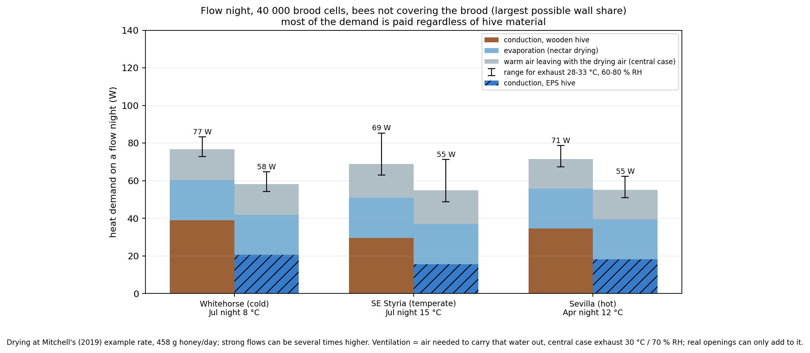
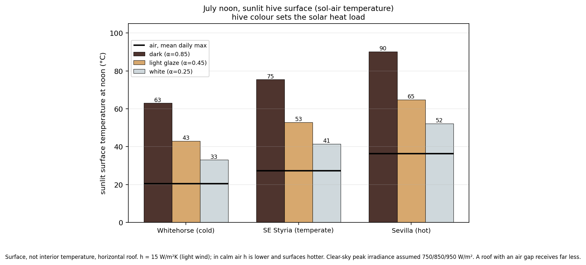

# Why hive insulation has no general answer
## A heat-balance view of published thermal and field data

**Jakob Ploder** · Technical note, version 1.0 · not peer reviewed

---

### Abstract

Hive insulation is usually discussed in absolutes: insulated hives or tree-like cavities as the answer to weak build-up, winter losses and poor yields, or the single-walled wooden hive as all a colony ever needs. This note argues that neither position holds as a general rule. It combines published measurements, a transparent heat-balance model and official climate normals for a cold (Whitehorse, Yukon), a temperate (south-eastern Styria, Austria) and a hot site (Sevilla, Spain). The effect of the hive wall depends on quantities that change through the year and between colonies: the ratio of bees to brood, how densely the bees cover the brood, the night temperature, sunlight, and the air exchange needed to dry nectar. For a brood nest of 20 000 cells on an average March night in south-eastern Styria, the wall decides between about 2 W and 14 W, depending on how densely the bees cover the brood. On nectar-flow nights most of the heat demand comes from evaporation and from the warm air that must carry the moisture out, and neither depends on the wall. On warm days the direction of the effect can reverse: in shade a conductive wall helps the colony shed surplus heat, in full sun insulation or a light colour reduce the load. Winter is where the only recent randomized trial found for this note points to a benefit: in a re-analysis of its public data, colonies with winter covers lost about 2–4 kg less mass over the winter and fewer died, but neither difference is statistically secure, and the trial fell in an exceptionally cold February. The heat-balance model used here is too uncertain in winter, by about a factor of two depending on cluster size, and is not used for winter savings. For spring build-up and yield, reported effects are confined mainly to weak or young colonies, and none of the studies reviewed here that are free of major confounding has shown higher yields of established colonies. The limits of every source are stated explicitly.

---

### 1 Why this note

Beekeepers choosing hives and accessories meet contradictory advice, often delivered with great certainty. On one side, insulated hives, insulated follower boards and hives imitating tree cavities are presented as remedies for weak build-up, winter losses, poor yields and even Varroa. On the other side, the single-walled wooden hive is defended as the only natural and sufficient choice. The author is a commercial beekeeper in south-eastern Styria and has tried many of these measures himself.

The aim of this note is to show why the question has no general answer, which physical quantities decide it at a given apiary, and where confident claims on either side go beyond what has been measured. It adds no controlled field data. Its sources were selected, not found by a systematic literature search; wherever it says that something has not been shown or measured, this refers to the sources reviewed here. It sorts existing results by the thermal situation of the colony, uses a simple model to show how strongly the outcome depends on conditions, and states plainly what each source can and cannot show (Section 5).

### 2 Sources and evidence levels

| Source | Used for | Type |
|---|---|---|
| Mitchell 2016 | lumped hive conductance: cedar 2.56–2.59 W/K, EPS 0.91–1.31 W/K | measured, peer-reviewed |
| Mitchell 2019 | heat needed for nectar drying; entrance flow | model, peer-reviewed |
| Mitchell 2023a | cluster-in-hive heat-transfer model applied to Owens (1971) | model, peer-reviewed |
| Mitchell 2023b | correction of Mitchell 2019 (entrance values, lumped conductances) | correction, peer-reviewed |
| Mitchell 2024 | resistance between brood and outside, with and without bees (CFD) | model, peer-reviewed |
| Southwick 1985 | cluster conductance and metabolism | measured, peer-reviewed |
| Southwick 1982 (as reported in Mitchell 2016 and 2023a) | whole-colony metabolism per kg | measured, peer-reviewed (secondary) |
| Stabentheiner et al. 2010, 2021; Kovac et al. 2018 | brood temperature; thermoregulation and cost of water collection | measured / review, peer-reviewed |
| Peters et al. 2017 | fanning behaviour and local air speed | measured, peer-reviewed |
| Seeley 1995 | annual nectar budget | compiled, monograph |
| St. Clair et al. 2022, with data set | winter covers vs. uncovered hives, randomized, Illinois; raw data re-analysed here | field trial, peer-reviewed; data CC0 |
| Erdoğan 2019 | wood vs. polystyrene vs. composite hives | field trial, peer-reviewed |
| Erat & Menemen 2019 | plastic vs. wooden hives, 3 years | field trial, peer-reviewed, non-indexed |
| Alburaki & Corona 2022 | polyurethane vs. wooden hives in winter | field trial, peer-reviewed (abstract only examined) |
| Sheridan 2020 | insulated vs. standard hives, sub-arctic Yukon | field trial, MSc thesis (grey literature) |
| Villumstad 1974 | single- vs. double-walled hives, Norway | original not examined; data as tabulated by Sheridan 2020 |
| Brother Adam 2002 | makeshift hive with 1.3 cm walls vs. double-walled hives at Buckfast | practitioner monograph |
| GeoSphere Austria, ECCC, AEMET | climate normals 1991–2020 | official station data (partly via secondary tables) |
| Author and fellow beekeepers | insulation measures in practice | uncontrolled practitioner observation |

### 3 The colony's heat balance

**3.1 Supply and demand.** A colony must hold its brood near 35 °C. The heat needed for that, plus extra loads such as nectar drying, is the demand. What the bees produce anyway at their normal level of activity is the supply. When supply falls short, the colony is in deficit: it heats actively, which costs stores, or lets the brood cool. When supply exceeds demand, the colony has to remove the surplus by ventilation, evaporation of water and, in the extreme, by bees leaving the hive, which also costs energy. The wall therefore matters in both directions: in deficit a better-insulated wall reduces the heating effort, in surplus a more conductive wall can reduce the cooling effort.

**3.2 How the heat leaves.** Heat flows from the brood through two resistances in series: an inner part made of bees, combs and the air between them, and the hive wall (1/L_total = 1/L_inner + 1/L_wall). The inner part depends on the size of the brood nest and on how densely bees cover it. From Mitchell's (2024) CFD results, two bounds can be derived for a brood nest of about 10 000 cells (six combs with 214 × 100 mm of brood each; this reading assumes both comb faces, which the paper does not state explicitly): about 0.2 W/K when bees densely cover the brood and about 0.85 W/K for the nest without bees. The dense value agrees with Southwick's (1985) laboratory measurements on winter clusters. For larger brood nests the inner conductance is scaled with brood area.

The wall values are Mitchell's (2016) measurements on a single brood box: 2.6 W/K for 19 mm cedar and 1.0 W/K for EPS. A 25 mm spruce wall, as in the author's Zander hives, has practically the same thermal resistance as 19 mm cedar (about 0.19 m²K/W), so the wood value applies to it as well. The measured EPS hives ranged from 0.91 to 1.31 W/K. Using 1.0 W/K favours EPS: with 1.31 W/K, the difference between wood and EPS in the March example of Section 3.5 falls from 13.8 to 10.0 W.

The larger the brood nest, the smaller the inner resistance and the more the wall decides. The more densely bees cover the brood, the more the inner part dominates and the less the wall matters. Neither the brood area nor the density of cover is fixed; both change within weeks.

**3.3 Heat per bee depends on the season.** Heat demand is given in watts throughout. Converting it into a number of bees requires the heat output per bee, and that varies with season and activity. Southwick's (1985) measurements on a broodless winter cluster correspond to about 0.5 mW per bee. Southwick (1982), as reported by Mitchell (2016), found 5 W per kg of bees in a tight cluster at 10 °C and up to 20 W per kg in unclustered colonies at 20 °C, i.e. about 0.5–2 mW per bee. Seeley's (1995) summer nectar budget corresponds to roughly 1 mW per bee including flight. No single value fits the whole year. As a rule of thumb, 1 W corresponds to about 1 000–2 000 bees in winter and early spring and to about 500–1 000 bees in the active season.

**3.4 Winter: measured, not modelled.** In winter the colony sits in a cluster. How much of its heat loss the wall decides depends on the basis used. In the model used here, with Southwick's (1985) laboratory value for tight clusters, the wall carries only about 7 % (wood) or 17 % (EPS) of the total resistance. Mitchell's (2023a) model of a cluster in a wooden hive, applied to Owens' (1971) field data, attributes about 14 % of the temperature drop to the wall and a further 12 % to the air layer at its outer surface, which the measured wall values include; the comparable share is about 26 %. Intact colonies in hives lose two to three times as much heat per kilogram of bees as laboratory clusters: about 0.57 W/K per kg for colonies (Southwick 1982, as cited by Mitchell 2023a; a gradient, not a conductance) against 0.2–0.3 W/K per kg read from Fig. 4 of Southwick (1985) for clusters of 0.6–1.2 kg. The reasons are not resolved. Further effects raise winter losses above those of a laboratory cluster: the wall values were measured in still air, whereas wind increases the loss of a thin wooden wall more than that of an insulated one; air exchange and moisture are not included; and once brood rearing starts, which in south-eastern Styria is usually early to mid January (author's observation), the core is held at 34–35 °C. This note's steady-state model, applied to the period of the trial described next, 9 November to 30 March, with −7 °C throughout (about as cold as its coldest month), depends strongly on cluster size, which the trial did not record in winter. Taking 0.2 W/K per kilogram of bees, the lower end of Southwick's values, a cluster of about 1 kg (0.2 W/K) gives about 5 kg of sugar, or 6.5 kg of stores, for an uncovered wooden hive, a little under half the net loss measured in surviving uncovered colonies (14.3 kg, n = 15; the net loss excludes the feed added in February). For 1.5–2 kg of bees (0.3–0.4 W/K) it gives 9–12 kg of stores, up to about 85 % of that loss. The model basis is therefore too uncertain, by about a factor of two, to estimate winter savings, and it is not used for them.

The only recent randomized, peer-reviewed field trial found for this note (St. Clair et al. 2022; Section 4) published its raw data, which were re-analysed for this note with simple comparisons (`model/st_clair_reanalysis.py`). Between 9 November and 20 January, the last weighing before the hives were opened for feeding, surviving covered colonies lost 2.4 kg less mass than uncovered ones (approximate 95 % interval −1.8 to +6.6 kg). Over the whole winter the difference was 2.5–3.8 kg depending on the end date, with intervals that include zero; covered colonies lost less at six of eight apiaries. Much of the difference arises between 20 January and 22 February. That window combines a change of hive configuration for feeding, in which 11 of 43 colonies were more than 2 kg heavier on 2 February than on 20 January, about two and a half times the rate in other winter intervals, so some were apparently weighed after feeding, and the February 2021 cold wave, when daily mean temperatures in central Illinois were 20–30 °F (11–17 K) below normal and up to about 30 cm of snow fell, mostly about 18–25 cm in Champaign County reports (National Weather Service 2021). Both groups received the same feed in this window. Covered colonies ended it 1.5 kg heavier, uncovered colonies 1.1 kg lighter; the 2.7 kg difference within five weeks exceeds the 2.4 kg accumulated over the ten weeks before. It may reflect higher consumption of uncovered colonies during the cold wave, inconsistent weighing around the feeding, or both; the data cannot separate them. Allowing for a step at the feeding, the rates of mass loss did not differ (p = 0.21, or 0.80 with the 2 February weighing excluded), but such a step also absorbs any real difference during the cold wave in the same window. In the authors' own comparison with a conventional scale, the weighing method differed by 5.9 kg on average, with a standard deviation of 5.7 kg. One of 21 covered and 6 of 22 uncovered colonies died (Fisher exact test p = 0.095, Boschloo test p = 0.050, authors' survival model p = 0.0007), a borderline result. The trial therefore points in one direction on every measure, but on its own supports neither a firm size nor significance.

Transfer to Central Europe is a further question. February 2021 averaged about −5 to −7 °C at stations near the trial (National Weather Service 2021), while the February normal in south-eastern Styria is about +1 °C. The only randomized winter trial found that measured consumption and losses fell into an unusually cold winter, with its coldest spell in the decisive window. Winter is nevertheless where the available evidence points most clearly to a benefit of insulating measures; how large that benefit is, and whether it is reliable, is open.

**3.5 Spring and summer brood nests.** Fig. 1 shows the heat needed to keep a brood nest at 35 °C as a function of night temperature, for 10 000, 20 000 and 40 000 cells, with and without covering bees. The dots below mark the monthly mean night minima of the three sites.

*Fig. 1. Heat demand of the brood nest at night. The shaded area between solid (wood) and dashed (EPS) lines is the part decided by the wall.*

On an average March night in south-eastern Styria (0.3 °C), a brood nest of 20 000 cells needs about 36 W in a wooden and 22 W in an EPS hive if the bees do not cover it, and about 12 W and 10 W if they cover it densely. The wall thus decides between 2 and 14 W, roughly 2 000 to 28 000 bees' worth of heat in early spring. For 40 000 cells the range is 6–24 W. The factor of six to seven between the two cases follows from one quantity, the density of cover. It varies from night to night and is not observed directly; the ratio of bees to brood that drives it can be estimated, for example with the Liebefeld method (Imdorf et al. 1987). The dense-cover case rests on the same laboratory basis as the winter cluster and may understate real losses (Section 3.4). The uncovered case, in turn, marks the heat that would be needed, not heat a colony actually spends: on such a night a colony contracts and gives up peripheral brood, so the consequence is chilled or lost brood rather than a higher heat output. The wall matters most where a colony has started more brood than its bees can cover on a cold night, and least where there are ample bees for the brood.

**3.6 Nectar flow: drying needs air, and air carries heat.** Mitchell's (2019) example drying rate (458 g honey per day from 30 % nectar) requires 21.4 W for evaporation. Strong flows can be several times higher. The 763 g of water per day also has to leave the hive, and it can only leave with air. How much air depends on how much more moisture the outgoing air carries than the incoming air. For outgoing air at 30 °C and 70 % relative humidity, the three sites need 0.6–1.0 L per second on a flow night, and this air carries 16–18 W of heat out of the hive. The figure depends on the state of the outgoing air, which is not known: for 28–33 °C and 60–80 % relative humidity it ranges from 0.4 to 2.2 L/s and from 11 to 34 W. Real entrances, mesh floors and gaps can only add to this minimum.

On a flow night the wall therefore accounts for a smaller share of the demand than on a dry night: about 1–8 % with densely covered brood and up to about a quarter for a large, uncovered brood nest (Fig. 2). More ventilation or larger flows reduce the share further. Mitchell's (2019) point that drying costs heat is correct for cool nights; most of that cost is paid regardless of hive material.

*Fig. 2. Heat demand on a flow night, 40 000 brood cells, uncovered brood (largest wall share). Error bars: range of the ventilation term for exhaust air at 28–33 °C and 60–80 % relative humidity.*

**3.7 Warm days: the direction of the wall effect changes.** On warm days strong colonies run a heat surplus; Peters et al. (2017) filmed ventilation fanning at ambient temperatures of only 23–26 °C. Removing surplus heat costs energy: fanning is work of the flight muscles, and water for evaporative cooling has to be collected in flight. The energetics of individual water collectors (Kovac et al. 2018) and the mechanisms of colony thermoregulation (Stabentheiner et al. 2021) are well studied, but no measurement of the total cost of cooling for a whole colony was found.

In shade, a conductive wall helps: at 25–28 °C outside, one wooden brood box sheds about 3–7 W more than an EPS box with an uncovered brood nest of 20 000–40 000 cells, heat the bees would otherwise have to remove themselves. Hives with several boxes have correspondingly more wall area. The advantage shrinks as outside air approaches hive temperature and reverses above it, when heat flows inward and insulation protects. In sunlight a second effect dominates: at noon in July a dark roof surface reaches 63–90 °C at the three sites in light wind, more in calm air, while a white surface stays 30–38 K cooler (Fig. 3). By a rough estimate (roof area about 0.22 m², U ≈ 2.8 W m⁻² K⁻¹, 40 K between dark roof surface and hive interior), a dark wooden roof alone lets in about 25 W in full sun, a substantial fraction of a colony's own heat output; insulation reduces this, and a light colour, shade or a ventilated roof reduce it more. In spring the same sunlight is welcome, and insulation blocks that gain as well. Which effect prevails at a given hive depends on shade, colour, orientation and roof design.

*Fig. 3. Sunlit surface temperature of a horizontal roof, not interior temperature.*

**3.8 Moisture and condensation.** Water evaporated by the bees can leave the hive only with air or condense on the coldest surface. In a wooden hive the coldest surfaces are the walls; condensate runs down there, and wood absorbs and releases moisture. In a fully insulated hive there is no cold wall; vapour that is not ventilated out condenses at the remaining cold spots such as floor, entrance and outer combs, and EPS absorbs hardly any water. The air in the middle of such a hive can therefore be drier while mould forms at the edges. This is consistent with both kinds of evidence available: two field studies measured lower relative humidity in insulated hives at their sensor positions (Sheridan 2020; Alburaki & Corona 2022), and practitioners report mould and damp in insulated hives. Whether insulation makes a hive drier or damper depends on ventilation and on where condensation forms, not on the wall material alone.

### 4 What the field studies show

**St. Clair et al. (2022)**, central Illinois, about 40° N, winter 2020–21. Forty-three full-sized, well-provisioned colonies in two deep boxes plus a honey super (mean hive mass 64 kg), randomly assigned within eight apiaries to a winter cover (black corrugated polypropylene sleeve, 3.8 cm foam board on the inner cover, upper entrance) or no cover, and otherwise managed identically. According to the published data, 21 colonies were covered and 22 uncovered; 1 and 6 of them died. The authors report a significantly lower rate of mass loss in covered colonies (p = 0.003), lower consumption of a mid-winter sugar cake (p = 0.04) and lower mortality (p = 0.0007), with mass loss diverging from late February. A simple re-analysis of the public data (Section 3.4) finds 2.4 kg less mass loss before feeding and 2.5–3.8 kg over the winter, 62 % against 71 % of the sugar cake consumed, and no statistically secure difference in any of these. Mean inside temperature did not differ overall. In spring, adult bee numbers, capped brood area and fat reserves of nurse bees did not differ between groups.

**Villumstad (1974)**, Hedmark, Norway, as tabulated by Sheridan (2020). Medium-strong colonies yielded 36.7 vs. 34.9 kg (1965) and 46.1 vs. 49.3 kg (1966) in double- vs. single-walled hives, no consistent difference. Weak colonies from swarms yielded 3.1 vs. 1.9 kg and weak overwintered colonies 32.3 vs. 27.3 kg, both in favour of insulation. According to Sheridan's summary, wintering and spring development were better in insulated hives, which stored more honey in summer and less in autumn; Villumstad attributed this to earlier build-up.

**Sheridan (2020)**, sub-arctic Yukon, 8 vs. 8 wooden Langstroth hives; the treatment group was insulated externally with 50 mm high-density EPS on the walls and under the floor and 100 mm on top. Nucleus colonies were installed in May 2020. Insulated hives were warmer and had smaller daily temperature swings near the brood, and brood was found more often on the outer frames. Net honey storage was about twice as high from mid-June to mid-July (p = 0.07) but only 10 % higher from mid-July to mid-August (p = 0.77); weight gain did not differ. Varroa mite drop was lower in insulated hives (3.0 vs. 9.2 mites per day, p = 0.13). Among the 12 colonies with reliable records, three insulated and no control colonies swarmed. The author concludes that full-season gains of 0–30 % are possible, "with the lower end of that range being more likely".

**Erdoğan (2019)**, 2137 m, June–August 2018, 10 colonies per type. Inside temperature between the top bars ranged 20.1–38.6 °C in wooden hives and about 25–34 °C in polystyrene and composite hives. Brood area was 4342, 5056 and 5384 cm², honey yield 17.1, 20.2 and 23.0 kg; by the reported significance letters only the composite hive differed from wood.

**Erat & Menemen (2019)**, 13 wooden and 10 plastic hives over three years. Survival after the first winter was 90 % in plastic and 54 % in wooden hives (p = 0.089); swarming 40 % vs. 15 % (p = 0.34). Honey per frame was higher in plastic hives (2265 vs. 1634 g, p = 0.028).

**Alburaki & Corona (2022)**, 9 polyurethane vs. 9 wooden hives in winter. Mean inside temperature 10.20 vs. 9.73 °C, relative humidity 52 vs. 62.5 %, smaller temperature oscillations in polyurethane hives. Consumption and survival are not reported in the abstract.

Taken together: in winter, the one randomized trial reviewed here points to lower consumption and fewer losses with covers, by a few kilograms and without statistical certainty, in an unusually cold winter. For build-up and yield, effects were found in weak or young colonies, early in the season and under large temperature swings, and were small or absent in established, strong colonies. Insulated hives consistently showed steadier inside temperatures.

### 5 What each source can and cannot show

**Mitchell 2016.** The conductances were measured on empty hives heated from inside, with the top sealed, the roof weighted, the entrance reduced to its minimum, in still air. Forced convection, evaporation and condensation were excluded by design. They describe a closed hive in winter configuration; ventilation paths come on top. The paper itself notes that top vents can negate the effect of insulation.

**Mitchell 2019.** The efficiency formula uses one inside temperature and treats all heat lost through the wall as a cost. When the outside is warmer than the inside, the formula gives efficiencies above 1, i.e. it counts outside heat as a gain; there is no upper temperature limit at which heat becomes a burden for the brood. The entrance airflow is evaluated for sensible heat only and then neglected. In the corrected version (Mitchell 2023b), which changed the entrance values and the lumped conductances quoted in the introduction, the term is about 0.5 W/K; with the corrected parameters and the full entrance area it is about 1.1 W/K. Either value is of the same order as the conductance of an EPS wall (1.0 W/K), so neglecting it is not justified, all the more as the same airflow has to carry the evaporated water (Section 3.6). Readers of the original 2019 version will find different entrance values there. The yearly figure of "more than 400 kg" of water is several times the water content of a typical annual nectar intake (Seeley 1995: about 120 kg of nectar) and presumably includes water collected for cooling. The only yield figure offered, "up to 30 %", is attributed to an online conversation. The conclusion that lower hive conductance offers "a firm theoretical foundation" for higher honey yields goes beyond the model, which applies to colonies in heat deficit.

**Mitchell 2023a.** A model study, applied to Owens' (1971) field data. Parts of the analysis assume a bare landscape under a cloudless, very dry sky; the wall-share results quoted in Section 3.4 come from the shaded, still-air case. The paper argues that a tightly packed mantle conducts heat better than loosely spread bees and should therefore not be called insulation. That is a statement about the bee layer compared with a dispersed state. Its whole-colony result (1.53 W/K) is consistent with Southwick's (1982) measurements on colonies in hives; both imply higher losses per kilogram of bees than Southwick's (1985) laboratory clusters (Section 3.4). The conclusion that forced clustering in thin-walled hives may be regarded as cruel is an ethical judgement, not a result of the heat-transfer model.

**Mitchell 2024.** Bees are represented as a porous medium of fixed density in each run, so the active regulation of cluster density is not part of the model. Radiation and evaporation are excluded, the latter justified with a loss share below 2 % taken from conditions without nectar drying. Only a single brood box with isothermal brood is modelled, and whether the stated brood area refers to one or both comb faces is not explicit; the one-face reading would lower the inner conductances used here from 0.20 and 0.85 W/K to about 0.10 and 0.37 W/K. The finding that the bee space above the combs raises heat loss by up to about 70 %, compared with combs attached to the roof of a tree cavity, is directly useful for practice and concerns convection, not wall material.

**Southwick 1985.** Laboratory measurements on broodless clusters at constant 2 °C, reporting minimum overnight values. They describe a tight cluster at minimum metabolism in a chamber, not a colony in a hive; per kilogram of bees they are a third to a half of the value reported for intact colonies in hives (Southwick 1982, 0.57 W/K per kg as cited by Mitchell 2023a). Fig. 4 of the paper is mass-specific (W kg⁻¹ °C⁻¹); read as total conductance, it overstates the values for small clusters many times over (about twentyfold at 50 g) and roughly matches them for clusters of about 1 kg.

**Peters et al. 2017.** The frequently quoted 0.94 m/s is the speed of a vortex behind a single scenting bee in a 5 × 5 cm acrylic tunnel, which the authors consider a slight underestimate of the local flow. It is not the ventilation rate of a hive.

**Seeley 1995.** Budget figures for wild-type colonies in New York State; managed colonies with higher yields turn over more.

**St. Clair et al. 2022.** The strongest of the studies reviewed here: randomized within apiaries, adequately sized, colonies managed identically and treated against Varroa before winter, and, unusually among the studies reviewed here, with raw data published under an open licence, which made the re-analysis in this note possible. The cover combined several measures (a black sleeve that also absorbs sunlight and breaks wind, roof insulation and an upper entrance), so their individual contributions cannot be separated. It covers one winter in one region, and that winter included a severe cold wave. The text gives the group sizes the other way round from the data (22 covered and 21 uncovered instead of 21 and 22); the mortality percentages of 4.8 % and 27.3 % match the data, a further 28.6 % does not. The authors' significant result for the rate of mass loss (p = 0.003) is reproduced by a simple test on their own slope values, and a simple re-analysis of mass over time finds a difference among surviving colonies (p = 0.03) that disappears once a step for the feeding on 2 February is allowed for (p = 0.21–0.80). The result therefore arises mainly in the window of the feeding step; that step, however, also absorbs any real difference during the cold wave in the same window. On that day the cover board was replaced by a 0.6 kg feeder board with sugar cake, as documented in the data description; this added air space above the combs, and some colonies were apparently weighed after feeding and others before. In the authors' own comparison with a conventional scale, the weighing method differed by 5.9 ± 5.7 kg, and 13 of 128 weighing intervals between November and January show gains of more than 2 kg. The mean hive mass of 64 kg documents stores, not colony strength.

**Erdoğan 2019.** One season, one high-altitude site, 10 colonies per type, and hive types that differ in more than the wall material. By the significance letters in the table, only the composite hive differed from wood in honey yield, whereas the text reports both insulated hive types as significantly better than wood. The in-hive temperatures are the most robust result.

**Erat & Menemen 2019.** Groups were unequal because three extra wooden hives were added. The significant honey result compares ten frames each from the three plastic and two wooden hives still alive in year three, so frames stand in for colonies. Mortality was high in both groups (70 % and 85 % by the end). The authors attribute better wintering to both the insulation and the ventilation holes under the plastic hive, so material and ventilation are confounded.

**Sheridan 2020.** An MSc thesis, not peer-reviewed. Eight pairs over five apiaries and three beekeepers, one season in a sub-arctic climate, with young colonies and several colonies excluded after swarming or interventions. One apiary on a dark shipping container produced 37 % more honey storage than the others, an effect larger than the insulation effect; pairs were balanced across apiaries, but the noise is large. The first-period honey result includes a phase of syrup feeding.

**Villumstad 1974.** The original was not available. It is cited with three different volume and page references in the literature (Apiacta 9:116–118; Apiacta 3:116–118; Apiacta 9:277–281). The last shares its pages with Southwick (1982), which suggests a mix-up in secondary sources. Secondary sources also disagree on whether the study reports the thermal properties of the hives. The data used here come only from Sheridan's table, whose caption labels the hive types the other way round from its rows. Winter-feed figures circulating for this study could not be traced to a source and are not used.

**Alburaki & Corona 2022.** Only the abstract was examined. Winter only; as far as the abstract shows, temperature and humidity only. A 0.5 K difference in mean inside temperature is small. Calculated from the reported means, the absolute humidity at the sensor was also roughly 14 % lower in polyurethane hives, so the lower relative humidity is not only a temperature effect; where the sensors were placed is not known.

**Practitioner reports (Section 6).** Uncontrolled and qualitative; they indicate direction, not size.

### 6 Practitioner observations

The following is reported from practice. It is not a controlled comparison: colonies were not counted or measured systematically, and weak colonies may also have been managed differently in other respects. It is included because it spans several decades and a range of measures that the field studies above do not cover. The author did not compare insulation measures during winter, so these observations do not bear on the winter results in Sections 3.4 and 4.

The author keeps bees commercially in south-eastern Styria in 10-frame Zander hives (a German frame standard with a footprint similar to Langstroth) built from spruce about 25 mm thick. Over several seasons he tried and compared a number of insulation measures, and the pattern was always the same. Insulated follower boards, made of polyurethane with an aluminium facing, had a clearly visible effect in weak colonies, more pronounced in the cold part of the year than in the warm part. In very strong colonies no effect was discernible. The only measure that made a noticeable difference in every case was insulating the roof, with 50 mm of polystyrene, and the author has kept it ever since. A plausible explanation is that warm air collects under the roof, and that an insulated roof on an uninsulated wooden hive moves condensation from above the brood nest, where it can drip onto the bees, to the side walls, where it runs off (Section 3.8).

To guard against his own perception bias, the author asked befriended beekeepers about their experience. Their accounts agreed, including informal comparisons going back a few decades, when winters in the region were markedly colder; there too, the effect of insulation was described as modest. Brother Adam describes comparing a makeshift hive with walls of 1.3 cm against double-walled hives at Buckfast Abbey, without finding a significant difference (Brother Adam 2002, p. 15).

These observations are consistent with the heat balance in Section 3.

### 7 Common claims: what has been measured

- **"Insulated hives or add-ons save a large share of winter feed."** The one recent randomized trial found for this note points to about 2–4 kg less mass loss over a winter for colonies with sleeve, roof insulation and windbreak combined (re-analysis of St. Clair et al. 2022, Illinois), without statistical certainty and in an unusually cold winter. No study reviewed here measured winter consumption in insulated and uninsulated hives in Central Europe.
- **"Insulated hives reduce winter losses."** In the same trial, 1 of 21 covered and 6 of 22 uncovered colonies died; significant in the authors' survival model, borderline in exact tests (p = 0.05–0.095). Both groups were managed identically and treated against Varroa before winter. It is one winter in one region. In the author's view, insulation can compensate for weaknesses whose causes lie elsewhere, but it does not replace Varroa control or good winter preparation.
- **"Colonies build up faster in spring."** Effects were reported for weak colonies (Villumstad), for young colonies early in a sub-arctic season (Sheridan), as larger brood areas in a high-altitude summer (Erdoğan) and in practice. In strong colonies no effect has been shown, and St. Clair et al. found no difference in adult bees or brood in spring after winter.
- **"More honey."** None of the studies reviewed here that are free of major confounding has shown higher yields of established, strong colonies in insulated hives. Erdoğan (composite hives, one high-altitude summer, hive types differing in more than the wall) and Erat & Menemen (per-frame comparison from three and two surviving hives) report higher yields with such confounding. The figure of "up to 30 %" traces back to an online conversation (Mitchell 2019) and to an MSc thesis from the sub-arctic Yukon with young colonies, whose author considers the lower end of 0–30 % more likely (Sheridan 2020). Neither can be transferred to established colonies in temperate climates.
- **"Less Varroa."** The one study reviewed here that measured it as an outcome found lower mite drop in insulated hives, but the difference was not significant (Sheridan 2020).
- **"An insulated box imitates a tree cavity."** Tree cavities differ from hives in shape, height and entrance position as well as in wall thickness (Mitchell 2016, 2024); wall insulation reproduces only one of these.
- **"Insulated follower boards are needed to keep the brood warm."** None of the studies reviewed here examined them. In practice (Section 6) they helped weak colonies, most clearly in the cold season, and made no discernible difference in strong ones.
- **"Insulation keeps hives dry" and "insulated hives go mouldy."** Both are reported, and both are physically possible (Section 3.8). Two studies measured lower humidity at their sensors in insulated hives; practitioners report mould. Which occurs depends on ventilation and on where condensation forms.
- **"Single-walled wooden hives are always sufficient; insulation is unnatural or harmful."** Not supported as a general rule either. In winter, the one randomized trial reviewed here points to benefits of covers; weak colonies under cold conditions showed benefits in the other studies; none of them demonstrated harm from insulation, although swarming was more frequent in insulated hives in two studies, without statistical significance. In shade, a wooden wall sheds somewhat more surplus heat in summer; in full sun, insulation or a light colour reduce the heat load.

### 8 Questions that decide the answer at a given apiary

Instead of a general recommendation, the heat balance points to a few questions. Each of them can shift the effect of the wall in either direction.

- **How many bees does the colony have relative to its brood?** The fewer bees per brood cell, the more of the heat demand depends on the wall (Section 3.5).
- **How cold are the nights, and is it winter?** Winter is where the only randomized trial found for this note points to a benefit (Section 3.4); in spring the wall matters most where brood outgrows the bees covering it (Section 3.5).
- **Is there a nectar flow?** Evaporation and the air needed to remove the water then make up most of the demand, independent of the wall (Section 3.6).
- **Does the hive stand in sun or shade, and what colour is it?** In shade a conductive wall helps shed surplus heat; in sun, insulation and light colours reduce the load (Section 3.7).
- **How is the hive ventilated, and where does condensation form?** This decides whether a hive stays dry or damp, more than wall material (Section 3.8).
- **Is there a bee space between the top bars and the cover?** Mitchell (2024) found that it raises heat loss by up to about 70 % compared with combs attached to the roof of a cavity; a sheet resting directly on the top bars closes it, in any hive.

### 9 Limitations and what would test this

- **Literature.** The sources were not identified by a systematic search. Statements that a study, trial or measurement does not exist refer to the literature reviewed here; a study that was missed could change them.
- **Winter.** Winter savings are not modelled; the model basis is uncertain by about a factor of two, depending on cluster size, and reaches close to the measured loss of surviving uncovered colonies. The measured difference comes from one trial in an unusually cold Illinois winter and is not statistically secure (Section 3.4).
- **Heat per bee** varies with season and activity (0.5–2 mW). Demand is therefore given in watts; bee numbers are indicative only.
- **Brood area and cover density.** The inner conductance is scaled linearly with brood area and bounded by two cases, dense cover and no cover; real colonies lie in between. The brood-area reading of Mitchell (2024) is itself uncertain by a factor of two.
- **Combining sources.** The inner conductance is obtained by subtracting a measured wall value (Mitchell 2016) from a simulated total (Mitchell 2024). Both concern the same hive type, but the combination is an approximation.
- **Hive size.** Wall values apply to one brood box; colonies in several boxes lose and shed more heat in absolute terms.
- **Ventilation** is the minimum needed for drying at one example rate; the state of the outgoing air is unknown and changes the result by a factor of about three.
- **Cooling costs** of colonies in heat surplus are not quantified in the literature found.
- **Moisture** is discussed qualitatively; no model of condensation is attempted.
- The model is steady-state and ignores heat storage in combs and stores and the timing of drying over the day.
- **Climate inputs** are station normals for single stations. South-eastern Styria is represented by Bad Gleichenberg, 9 km from Feldbach, because the Feldbach record starts in 1999. Monthly mean night minima are averages; individual cold nights, which matter most for brood, are colder.
- **Sample size.** How many colonies a field trial needs depends strongly on how well colonies are equalized beforehand. From the standard errors reported by Erdoğan (2019), the between-colony coefficient of variation of honey yield was 11–16 %; at that level, detecting a 10 % difference needs about 20–40 colonies per group (two-sided α = 0.05, 80 % power). Ordinary production colonies spread over several apiaries vary more and need many times more.

**How much each input moves the result.** The table collects the effect of each uncertain input, as computed in this note. Each of them shifts the outcome more than the differences usually promised for insulated hives.

| Input | Range considered | Effect |
|---|---|---|
| Density of bee cover on the brood | dense vs. none | heat decided by the wall: 2 vs. 14 W (factor 6–7; 20 000 cells, March night, SE Styria) |
| Size of the brood nest | 20 000 vs. 40 000 cells | 2–14 W vs. 6–24 W |
| Basis for winter losses | laboratory clusters vs. colonies in hives | heat loss per kg of bees factor 2–3; modelled winter loss of an uncovered wooden hive about 45–85 % of the measured one, depending on cluster size |
| State of the outgoing air | 28–33 °C, 60–80 % RH | heat carried out by drying air 11–34 W (factor 3) |
| Reading of brood area in Mitchell (2024) | both vs. one comb face | inner conductances about halved |
| EPS wall value | 1.0 vs. 1.31 W/K | heat decided by the wall −28 % (March example) |
| Heat output per bee | 0.5–2 mW | conversion from watts to bees, factor 4 |

The most useful single measurement would be the winter weight loss of equalized colonies in insulated and uninsulated hives in Central Europe, and the heat output of colonies with known numbers of bees and brood cells on cold spring nights.

### 10 Reproducibility, data and conflicts of interest

All model figures and tables, and the side calculations quoted in the text, are generated by `model/model.py`; each parameter is listed with source and evidence category (A measured, B derived, C assumption). The re-analysis of St. Clair et al. (2022) is in `model/st_clair_reanalysis.py` and uses the published raw data (CC0), a copy of which is included in `data/`. Climate normals 1991–2020: GeoSphere Austria homogenised station series for Bad Gleichenberg, as compiled by Tauernwetter Forschung under CC BY 4.0, with relative humidity taken from the Tauernwetter climate-normals table for the same station; Environment and Climate Change Canada normals for Whitehorse A and AEMET normals for Sevilla Aeropuerto, both taken from the climate tables of the respective English Wikipedia articles, which cite these services (both tables retrieved September 2026; Whitehorse dew points from weatherstats.ca as cited there).

*Conflict of interest:* The author is a commercial honey producer and has no financial relationship with manufacturers or sellers of hives or hive accessories.

---

### References

Alburaki M, Corona M (2022) Polyurethane honey bee hives provide better winter insulation than wooden hives. *Journal of Apicultural Research* 61(2):190–196. https://doi.org/10.1080/00218839.2021.1999578

Brother Adam (2002) *Meine Betriebsweise: Ertragreich imkern wie im Kloster Buckfast.* 7th ed. Franckh-Kosmos, Stuttgart. (Comparison of a makeshift hive with 1.3 cm walls and double-walled hives, p. 15.)

Erat S, Menemen Y (2019) Comparison of plastic and wooden Langstroth hives in terms of some traits. *International Journal of Veterinary and Animal Research* 2(2):37–45.

Erdoğan Y (2019) Comparison of colony performances of honeybee (*Apis mellifera* L.) housed in hives made of different materials. *Italian Journal of Animal Science* 18(1):934–940. https://doi.org/10.1080/1828051X.2019.1604088

Imdorf A, Buehlmann G, Gerig L, Kilchenmann V, Wille H (1987) Überprüfung der Schätzmethode zur Ermittlung der Brutfläche und der Anzahl Arbeiterinnen in freifliegenden Bienenvölkern. *Apidologie* 18(2):137–146. https://doi.org/10.1051/apido:19870204

Kovac H, Käfer H, Stabentheiner A (2018) The energetics and thermoregulation of water collecting honeybees. *Journal of Comparative Physiology A* 204:783–790. https://doi.org/10.1007/s00359-018-1278-9

Mitchell D (2016) Ratios of colony mass to thermal conductance of tree and man-made nest enclosures of *Apis mellifera*: implications for survival, clustering, humidity regulation and *Varroa destructor*. *International Journal of Biometeorology* 60:629–638. https://doi.org/10.1007/s00484-015-1057-z

Mitchell D (2019) Thermal efficiency extends distance and variety for honeybee foragers: analysis of the energetics of nectar collection and desiccation by *Apis mellifera*. *Journal of the Royal Society Interface* 16:20180879. https://doi.org/10.1098/rsif.2018.0879

Mitchell D (2023a) Honeybee cluster—not insulation but stressful heat sink. *Journal of the Royal Society Interface* 20:20230488. https://doi.org/10.1098/rsif.2023.0488

Mitchell D (2023b) Correction: 'Thermal efficiency extends distance and variety for honey bee foragers: analysis of the energetics of nectar collection and dessication by *Apis mellifera*' (2019). *Journal of the Royal Society Interface* 20:20230598. https://doi.org/10.1098/rsif.2023.0598

Mitchell DM (2024) Are man-made hives valid thermal surrogates for natural honey bee nests (*Apis mellifera*)? *Journal of Thermal Biology* 122:103882. https://doi.org/10.1016/j.jtherbio.2024.103882

National Weather Service (2021) February 2021 climate summary, central and southeast Illinois; February 14–16, 2021 winter storm recap. NWS Lincoln, IL. https://www.weather.gov/ilx/February2021_Winter_ClimateSummary; https://www.weather.gov/ilx/Feb_15_2021_Winter_Storm_Recap

Owens CD (1971) *The Thermology of Wintering Honey Bee Colonies.* Technical Bulletin 1429. U.S. Department of Agriculture, Agricultural Research Service, Washington DC. https://ageconsearch.umn.edu/record/171857

Peters JM, Gravish N, Combes SA (2017) Wings as impellers: honey bees co-opt flight system to induce nest ventilation and disperse pheromones. *Journal of Experimental Biology* 220:2203–2209. https://doi.org/10.1242/jeb.149476

Seeley TD (1995) *The Wisdom of the Hive: The Social Physiology of Honey Bee Colonies*. Harvard University Press.

Sheridan E (2020) *i-HIVE – Hive Insulation Valuation Experiment: assessing the impacts of thermally improved beehives during the active season in a sub-arctic climate.* MSc thesis, University College Dublin. https://www.yukonu.ca/sites/default/files/inline-files/Eoin%20Sheridan%20-%20HIVE%20V3.pdf

Southwick EE (1982) Metabolic energy of intact honey bee colonies. *Comparative Biochemistry and Physiology A* 71:277–281. https://doi.org/10.1016/0300-9629(82)90400-5 (values as reported in Mitchell 2016 and 2023a)

Southwick EE (1985) Allometric relations, metabolism and heat conductance in clusters of honey bees at cool temperatures. *Journal of Comparative Physiology B* 156:143–149. https://doi.org/10.1007/BF00692937

St. Clair AL, Beach NJ, Dolezal AG (2022) Honey bee hive covers reduce food consumption and colony mortality during overwintering. *PLOS ONE* 17(4):e0266219. https://doi.org/10.1371/journal.pone.0266219

St. Clair A, Beach N, Dolezal A (2022) Honey bee hive covers reduce food consumption and colony mortality during overwintering [Dataset]. Dryad. https://doi.org/10.5061/dryad.80gb5mkss (CC0 1.0)

Stabentheiner A, Kovac H, Brodschneider R (2010) Honeybee colony thermoregulation – regulatory mechanisms and contribution of individuals in dependence on age, location and thermal stress. *PLoS ONE* 5(1):e8967. https://doi.org/10.1371/journal.pone.0008967

Stabentheiner A, Kovac H, Mandl M, Käfer H (2021) Coping with the cold and fighting the heat: thermal homeostasis of a superorganism, the honeybee colony. *Journal of Comparative Physiology A* 207:337–351. https://doi.org/10.1007/s00359-021-01464-8

Villumstad E (1974) Importance of hive insulation for wintering, development and honey yield in Norway. *Apiacta* 9 (page numbers inconsistent across citing sources). Original not examined; data as tabulated in Sheridan 2020.

*Climate data.* GeoSphere Austria, klima-v2 homogenised station series, Bad Gleichenberg, 1991–2020, compiled by Tauernwetter Forschung, https://doi.org/10.5281/zenodo.21281130, CC BY 4.0; relative humidity from https://tauernwetter.at/klimamittel/bad-gleichenberg.html. · Environment and Climate Change Canada, Canadian Climate Normals 1991–2020, Whitehorse A (WMO 71964), via https://en.wikipedia.org/wiki/Whitehorse. · Agencia Estatal de Meteorología, AEMET OpenData, Sevilla Aeropuerto, 1991–2020, via https://en.wikipedia.org/wiki/Seville. Wikipedia tables retrieved September 2026.
